# ZeroRAG System Architecture Diagram

## High-Level Architecture Overview

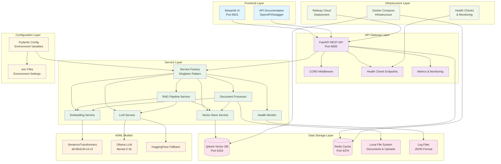

## Data Flow Architecture

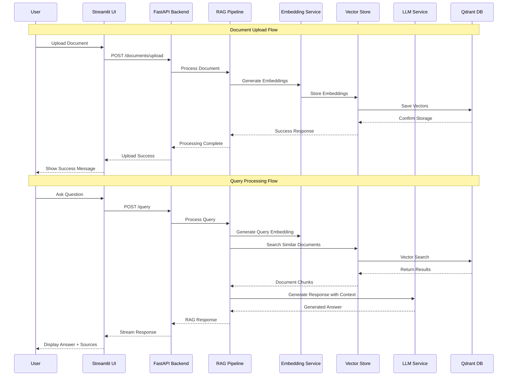

## Component Layer Architecture

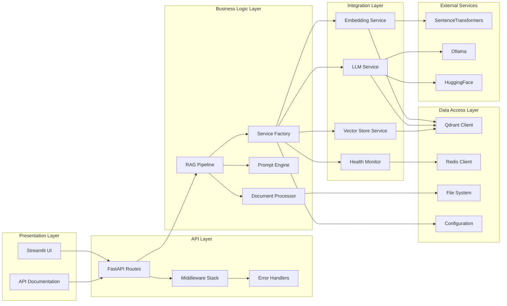

## Service Dependency Graph

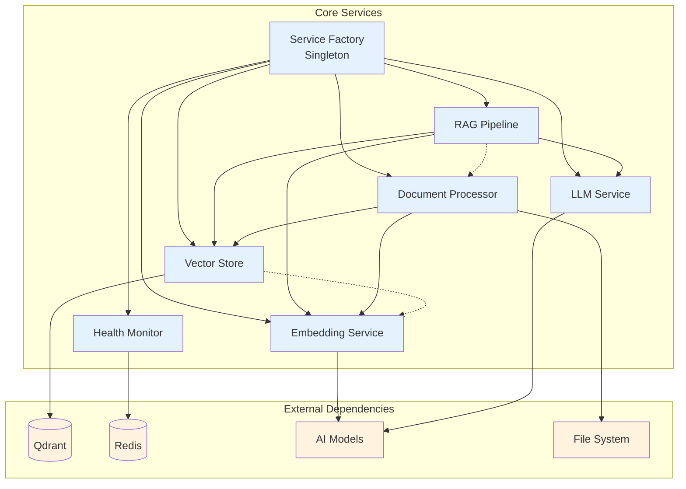

## Deployment Architecture

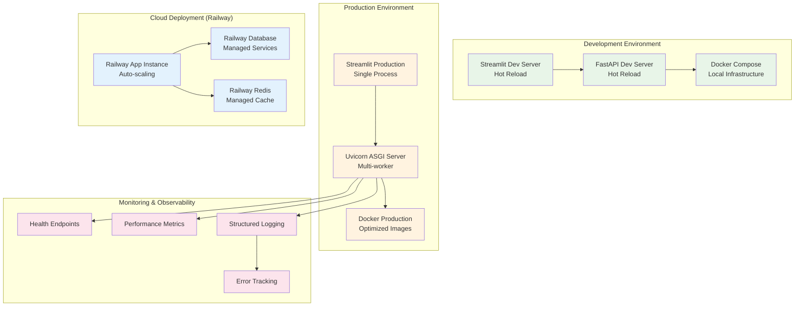

## Security Architecture

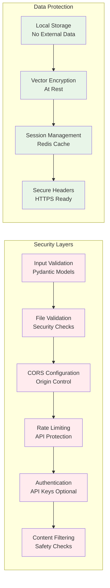

## Performance & Scalability Architecture

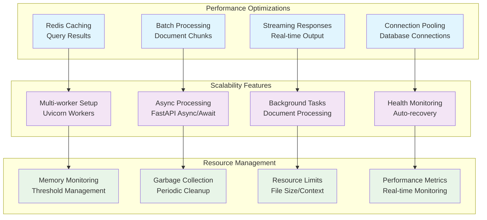

## Technology Stack Architecture

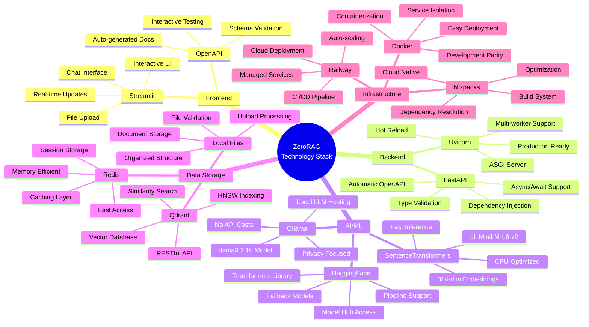

## Configuration & Environment Architecture

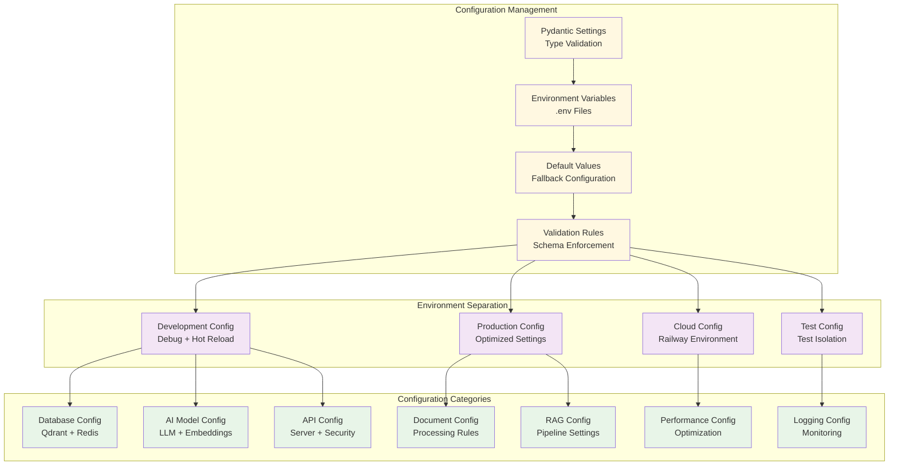

## Error Handling & Recovery Architecture

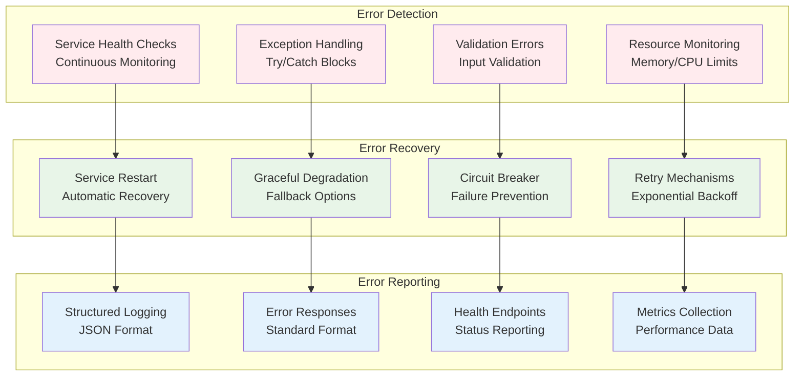

## API Design Architecture

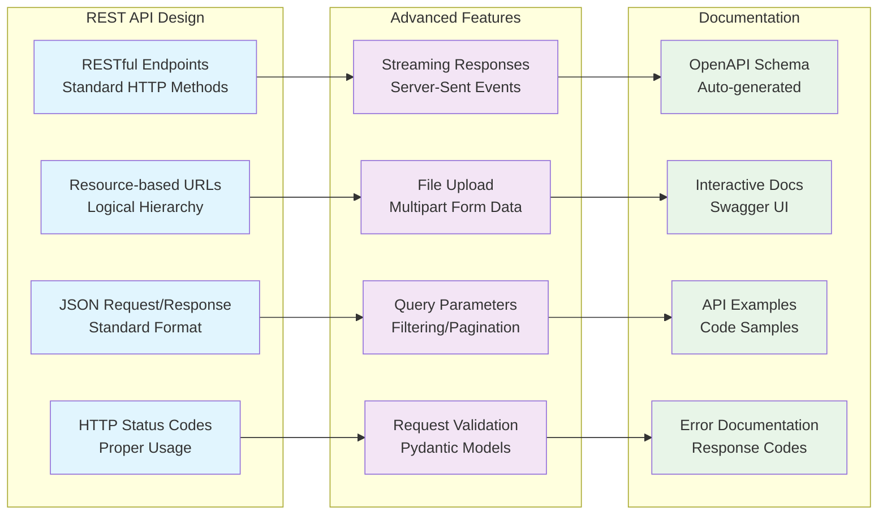

## Key Architectural Principles

### 1. **Modular Design**
- Service-oriented architecture with clear separation of concerns
- Pluggable components with well-defined interfaces
- Factory pattern for service management and dependency injection

### 2. **Scalability & Performance**
- Async/await throughout the application for non-blocking operations
- Connection pooling and caching for improved performance
- Streaming responses for real-time user experience
- Resource monitoring and automatic cleanup

### 3. **Reliability & Resilience**
- Comprehensive health monitoring and error recovery
- Graceful degradation when services are unavailable
- Automatic service restart and circuit breaker patterns
- Structured logging and error tracking

### 4. **Security & Privacy**
- Local deployment with no external data sharing
- Input validation and file security checks
- CORS configuration and optional API key authentication
- Content filtering and safety validation

### 5. **Developer Experience**
- Auto-generated API documentation with interactive testing
- Type safety with Pydantic models throughout
- Hot reload in development with production optimization
- Comprehensive configuration management

### 6. **Zero-Cost Architecture**
- Entirely built with free and open-source components
- Local AI models with no API costs
- Self-hosted infrastructure with minimal resource requirements
- Optional cloud deployment with cost-effective services